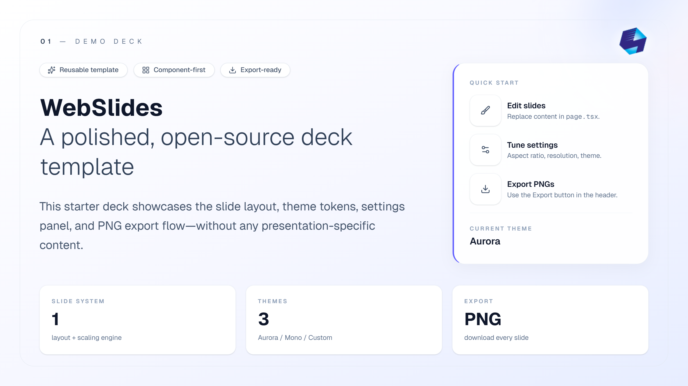

<p align="center">
  
</p>

# WebSlides

WebSlides is a friendly, export-ready slide deck template built with web technologies (React + Next.js + Tailwind).
Author your slides like a normal UI, then export crisp PNGs you can drop into Google Slides / Microsoft PowerPoint.

**For AI-assisted workflow:** refer to [`the AI Usage Guide`](docs/AI_Usage.md).


## Why WebSlides

- **Write slides as components**: compose layouts with React + Tailwind.
- **Consistent look**: reusable slide frame, theme tokens, and common UI primitives.
- **Export to PNG**: download every slide as an image (great for PPT/Slides import).
- **Presentation-safe sizing**: each slide is designed around **1080px of vertical space** (DOM height).

## Quick Start

Prerequisites: **Node.js** installed locally.

```bash
git clone https://github.com/ohnicholas93/webslides.git
cd webslides
npm install
npm run dev
```

Then open `http://localhost:3000`.

## Editing Slides

Slides live in `src/app/page.tsx`.

- Each slide is a `<PresentationSlide title="..."> ... </PresentationSlide>`
- Put static assets in `public/assets/` and reference them like `assets/my-image.png`
- Keep content within the slide frame (vertical space is limited; overflow looks bad in exports)

## Exporting Slides (PNG)

1. Run `npm run dev`
2. Open `http://localhost:3000`
3. Click **Export** in the header
4. You’ll get `slide-01.png`, `slide-02.png`, … as downloads

After that, import the PNGs into Google Slides / PowerPoint to produce a final `.pptx` if needed.

## Tuning Output (Theme / Size)

Use the **Settings** button in the header to adjust:

- Aspect ratio (16:9, 4:3, …)
- Export resolution (1080p/1440p/4K)
- Theme tokens (Aurora/Mono/Custom)
- Dark mode: supported via a **custom theme**; adjust typography colors for contrast/readability

## Repository Layout

- `src/app/page.tsx` — your deck content
- `src/components/slide.tsx` — slide frame + numbering + scaling
- `src/core/slide-exporter.tsx` — “Export” button logic
- `public/assets/` — images used inside slides
- `docs/assets/` — documentation screenshots / examples
