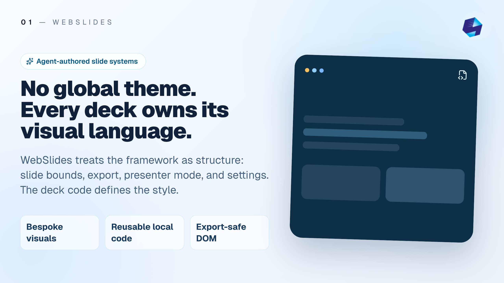

<p align="center">
  
</p>

# WebSlides

WebSlides is an export-ready slide deck system built with web technologies (React + Next.js + Tailwind).
Author your slides like a normal UI, then export them directly as PNG, PDF, or PPTX.

**For AI-assisted workflow:** refer to [`the AI Usage Guide`](docs/AI_Usage.md).


## Why WebSlides

- **Write slides as components**: compose layouts with React + Tailwind.
- **Stable slide mechanics**: reusable slide frame, scaling, export, and presentation runtime.
- **First class LaTeX support**: express math equations directly in your slides.
- **Multiple export formats**: export PNG, PDF, or PPTX from the app.
- **Presenter workflow**: presenter view, notes, and local session sync are built in.
- **Presentation-safe sizing**: each slide is designed around **1080px of vertical space** (DOM height).

## Quick Start

Prerequisites: **Node.js** and **npm** installed locally.

```bash
git clone https://github.com/ohnicholas93/webslides.git
cd webslides
npm install
npm run dev
```

Then open `http://localhost:3000`.

`npm run dev` starts both the Next.js app and the local WebSocket relay used for presentation session sync.

## Editing Slides

Slides live in `src/app/page.tsx`.

- Each slide is a `<PresentationSlide title="..."> ... </PresentationSlide>`
- Put static assets in `public/assets/` and reference them like `assets/my-image.png`
- Update your logo / branding by replacing `public/assets/logo.png` with your own logo.
- Keep content within the slide frame (vertical space is limited; overflow looks bad in exports)
- Deck-specific visuals should live in `src/app/page.tsx`; do not rely on a repo-level theme system.

### LaTeX / Math

Math typesetting is supported via KaTeX + a small helper component:

- Use `Latex` from `src/components/latex.tsx`
- Inline math: `$...$` or `\\(...\\)`
- Display math: `$$...$$` or `\\[...\\]`

Example:

```tsx
import Latex from "@/components/latex";

<Latex>{String.raw`Euler: $e^{i\pi}+1=0$`}</Latex>
```

## Presenting

1. Run `npm run dev`
2. Open `http://localhost:3000`
3. Click **View** in the header
4. Choose:
   - `Present` for audience view
   - `Presenter` for current slide, next slide, timer, and notes
   - `Notes` to edit presenter notes and session settings

Presenter notes are saved through `public/notes.json`, and session sync uses the local WebSocket relay on `ws://localhost:8787` by default.

## Exporting Slides

1. Run `npm run dev`
2. Open `http://localhost:3000`
3. Click **Export** in the header
4. Choose `PNGs`, `PDF`, or `PPTX`

`PNGs` downloads a zip containing `slide-01.png`, `slide-02.png`, …

`PPTX` is generated directly by the app from rendered slide images, so you do not need Google Slides or PowerPoint as an intermediate export step.

## Tuning Output

Use the **Settings** button in the header to adjust:

- Aspect ratio (16:9, 4:3, …)
- Export resolution (1080p/1440p/4K)
- Safe Auto Sizing for viewport fitting while editing/presenting

## Repository Layout

- `src/app/page.tsx` — your deck content
- `src/components/slide.tsx` — slide frame + numbering + scaling
- `src/core/slide-exporter.tsx` — “Export” button logic
- `src/core/presentation-runtime.tsx` — present/presenter views, notes, and session sync
- `src/app/api/presenter-notes/route.ts` — presenter notes persistence
- `scripts/webslides-ws.mjs` — local WebSocket relay
- `public/assets/` — images used inside slides
- `docs/assets/` — documentation screenshots / examples

## Common Fixes

- Ensure that Node.js and npm are installed locally.
- Ensure that packages have been installed with `npm install`.
- Ensure that all assets exist in the `public/assets/` directory and are referenced correctly.
- If presenter sync is not working, ensure the WebSocket relay from `npm run dev` is running and that port `8787` is available.
